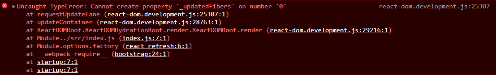

## 리액트에서 undefined 처리하기

### 리액트 컴포넌트에서 undefiend만 반환하여 랜더링하는 상황을 만들지 않아야 한다.

### 예를 들어 다음과 같은 상황은 에러를 발생시킨다.

```javascript
import React from 'react;

function App() {
    const username = undefined;
    return username
}

export default App;
```

### 위 코드를 저장하고 브라우저에 실행하면 아래와 같은 에러가 발생한다.

<br>

### 에러 확인하기



### 어떤 값이 undefined일 수 있다면, OR(||) 연산자를 사용하면 해당 값이 undefined일 때 사용할 값을

### 지정할 수 있으므로 간단하게 오류를 방지 할 수 있다.

### 반면, JSX 안에서는 undefined를 랜더링 하는 것이 가능하다.

<br>
<br>

```javascript
import React from 'react;

function App() {
    const username = undefined || '값이 없다';
    return username
}

export default App;
```

<br>

## JSX 안에서는 undefined 사용 가능

```javascript
function App() {
  const username = undefined || '값이 없다';
  return <div>{username}</div>;
}

export default App;
```

<br>

## 리액트 18 버전

### 리액트 18버전으로 설치해서 위와 같은 에러가 나지 않았다.

### 따라서 17버전으로 다운그레이드 하기

### 참고로 리액트 18버전에서는 undefined도 렌더링 가능하다

### 즉, 이제 컴포넌트가 undefined를 리턴해도 에러를 리턴하지 않는다. jsx에 return 문을

### 잊지 않도록 linter(ESLint)의 도움을 받는 것을 추천한다.
